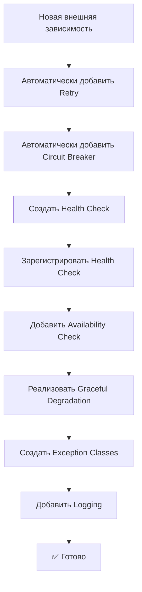

# 🤖 AI Development Guidelines для QuestCity Backend

> **Цель:** Автоматизировать применение архитектурных паттернов и best practices при разработке с помощью ИИ

**Дата создания:** 15 января 2025  
**Версия:** 1.0  
**Применимость:** Все модификации backend кода

---

## 🛡️ ОБЯЗАТЕЛЬНЫЕ RESILIENCE ПАТТЕРНЫ

### ⚡ При добавлении ЛЮБОЙ новой внешней зависимости:

**АВТОМАТИЧЕСКИ применять ВСЕ паттерны:**

#### 1. **Retry механизм** (ОБЯЗАТЕЛЬНО)
```python
from core.resilience.retry import retry_with_backoff, RetryConfig

# Создать конфиг для нового сервиса
NEW_SERVICE_RETRY_CONFIG = RetryConfig(
    max_attempts=3,
    base_delay=1.0,
    max_delay=60.0,
    backoff_factor=2.0,
    jitter=True,
    retryable_exceptions=(ConnectionError, TimeoutError, HTTPException)
)

# Применить к функции
@retry_with_backoff(NEW_SERVICE_RETRY_CONFIG)
async def new_service_operation():
    pass
```

#### 2. **Circuit Breaker** (ОБЯЗАТЕЛЬНО)
```python
from core.resilience.circuit_breaker import circuit_breaker, CircuitBreakerConfig

# Создать конфиг
NEW_SERVICE_CIRCUIT_BREAKER_CONFIG = CircuitBreakerConfig(
    failure_threshold=5,
    timeout_duration=60.0,
    success_threshold=3
)

# Применить декоратор
@circuit_breaker("new_service", NEW_SERVICE_CIRCUIT_BREAKER_CONFIG)
async def new_service_operation():
    pass
```

#### 3. **Health Check** (ОБЯЗАТЕЛЬНО)
```python
from core.resilience.health_check import get_health_checker

async def check_new_service_health() -> bool:
    """Health check для нового сервиса"""
    try:
        # Проверить доступность сервиса
        response = await new_service_client.ping()
        return response.status == 200
    except Exception:
        return False

# Зарегистрировать в startup app.py
def register_new_service_health_check():
    health_checker = get_health_checker()
    health_checker.register_check("new_service", check_new_service_health)
```

#### 4. **Availability Check** (ОБЯЗАТЕЛЬНО)
```python
async def new_service_operation():
    health_checker = get_health_checker()
    if not health_checker.is_service_available("new_service"):
        logger.warning("New Service недоступен по health check")
        raise NewServiceUnavailableError("New Service is currently unavailable")
    # ... выполнение операции
```

#### 5. **Graceful Degradation** (ОБЯЗАТЕЛЬНО)
```python
async def new_service_operation_with_fallback():
    try:
        return await new_service_operation()
    except NewServiceUnavailableError:
        logger.warning("New Service недоступен, используется fallback")
        return get_cached_result() or get_default_result()
```

---

## 📝 АВТОМАТИЧЕСКИЕ ШАБЛОНЫ

### 🔄 Шаблон для нового Repository
```python
from core.resilience import retry_with_backoff, circuit_breaker
from core.resilience.health_check import get_health_checker

class NewServiceRepository:
    def __init__(self, client: NewServiceClient):
        self._client = client
    
    @retry_with_backoff(NEW_SERVICE_RETRY_CONFIG)
    @circuit_breaker("new_service", NEW_SERVICE_CIRCUIT_BREAKER_CONFIG)
    async def operation(self, data: dict) -> dict:
        health_checker = get_health_checker()
        if not health_checker.is_service_available("new_service"):
            raise NewServiceUnavailableError("Service unavailable")
        
        return await self._client.operation(data)
    
    async def operation_with_fallback(self, data: dict) -> dict:
        try:
            return await self.operation(data)
        except NewServiceUnavailableError:
            return self._get_fallback_result(data)
```

### 🔄 Шаблон для нового External API
```python
import httpx
from core.resilience import retry_with_backoff, circuit_breaker

class NewAPIClient:
    def __init__(self, base_url: str, timeout: int = 30):
        self._base_url = base_url
        self._timeout = timeout
    
    @retry_with_backoff(HTTP_RETRY_CONFIG)
    @circuit_breaker("new_api", HTTP_CIRCUIT_BREAKER_CONFIG)
    async def make_request(self, endpoint: str, **kwargs) -> dict:
        health_checker = get_health_checker()
        if not health_checker.is_service_available("new_api"):
            raise NewAPIUnavailableError("API unavailable")
        
        async with httpx.AsyncClient(timeout=self._timeout) as client:
            response = await client.get(f"{self._base_url}/{endpoint}", **kwargs)
            response.raise_for_status()
            return response.json()
```

---

## 🔍 АВТОМАТИЧЕСКИЕ ПРОВЕРКИ

### ✅ Чеклист для ИИ (применять автоматически):

При создании/модификации кода с внешними зависимостями:

- [ ] ✅ **Retry** декоратор добавлен
- [ ] ✅ **Circuit Breaker** декоратор добавлен  
- [ ] ✅ **Health Check** функция создана
- [ ] ✅ **Health Check** зарегистрирована в app.py
- [ ] ✅ **Availability Check** добавлена в операции
- [ ] ✅ **Graceful Degradation** логика реализована
- [ ] ✅ **Exception Classes** созданы для сервиса
- [ ] ✅ **Logging** добавлен для операций и ошибок
- [ ] ✅ **Timeout** настроен для HTTP клиентов

### 🚨 Запрещенные паттерны:

❌ **НИКОГДА не создавать код без resilience:**
```python
# ❌ ПЛОХО - прямой вызов без защиты
async def bad_example():
    return await external_service.call()

# ✅ ХОРОШО - с resilience паттернами  
@retry_with_backoff(SERVICE_RETRY_CONFIG)
@circuit_breaker("service", SERVICE_CIRCUIT_BREAKER_CONFIG)
async def good_example():
    health_checker = get_health_checker()
    if not health_checker.is_service_available("service"):
        raise ServiceUnavailableError("Service unavailable")
    return await external_service.call()
```

---

## 🤖 ИНСТРУКЦИИ ДЛЯ ИИ

### 🎯 Автоматические действия:

1. **При упоминании новой интеграции** → сразу предложить resilience шаблон
2. **При создании Repository** → автоматически добавить все паттерны
3. **При HTTP клиенте** → обязательно retry + circuit breaker + timeout
4. **При Database операциях** → использовать существующие DATABASE_* конфиги
5. **При S3/File операциях** → использовать S3_* конфиги

### 📋 Процесс разработки:



### 🔧 Команды для генерации:

```bash
# Использовать скрипт для автогенерации
python scripts/generate_resilient_service.py --name NewService --type api
python scripts/generate_resilient_service.py --name PaymentProvider --type repository
```

---

## 📚 Ссылки

- **Resilience System:** `RESILIENCE_SYSTEM.md`
- **Code Review:** `CODE_REVIEW_REPORT.md`  
- **Generator Scripts:** `scripts/generate_resilient_service.py`
- **Validation:** `scripts/validate_resilience.py`

---

## 🚀 Связанные системы

- **Полная система автоматизации:** `AUTOMATION_SYSTEM.md`
- **Генератор сервисов:** `scripts/generate_resilient_service.py`
- **Валидатор качества:** `scripts/validate_resilience.py`
- **Память ИИ:** ID 4453596 с автоматическими правилами

---

*Документ автоматически применяется всеми ИИ ассистентами при разработке QuestCity Backend* 