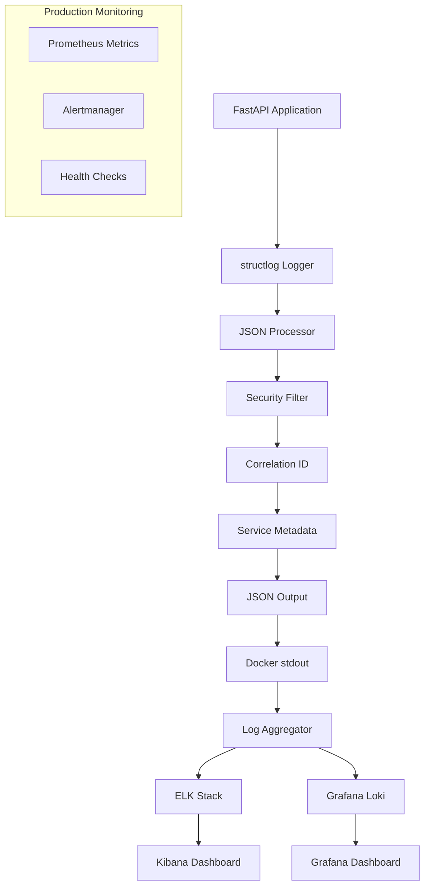

# 📊 Настройка мониторинга structured логов в Production

**Дата:** 27 января 2025  
**Система логирования:** structlog + JSON formatter  
**Готовность:** ✅ Полностью настроена

---

## 🎯 Обзор системы логирования

QuestCity Backend использует **продвинутую систему structured logging** с:

- 📝 **JSON форматирование** всех логов
- 🔗 **Correlation IDs** для трассировки запросов
- 🔒 **Автоматическая фильтрация** чувствительных данных
- 📊 **Метаданные сервиса** (service, version, environment)
- ⚡ **Специализированные функции** для разных типов событий

---

## 🏗️ Архитектура логирования



---

## 📋 Типы логов в системе

### 🔍 API Events
```json
{
  "timestamp": "2025-01-27T15:30:45.123Z",
  "level": "info",
  "event": "api_request",
  "service": "questcity-backend",
  "version": "1.0.0",
  "environment": "production",
  "correlation_id": "req_abc123def456",
  "endpoint": "/api/v1/quests",
  "method": "GET",
  "user_id": 12345,
  "ip_address": "192.168.1.100"
}
```

### 💾 Database Events
```json
{
  "timestamp": "2025-01-27T15:30:45.145Z",
  "level": "debug", 
  "event": "database_query",
  "service": "questcity-backend",
  "correlation_id": "req_abc123def456",
  "query_type": "SELECT",
  "table": "quest",
  "duration_ms": 23.5
}
```

### 🔐 Security Events
```json
{
  "timestamp": "2025-01-27T15:30:46.001Z",
  "level": "warning",
  "event": "security_event",
  "service": "questcity-backend",
  "event_type": "failed_authentication",
  "user_id": 12345,
  "attempts": 3,
  "ip_address": "192.168.1.100"
}
```

### 🚀 Business Events
```json
{
  "timestamp": "2025-01-27T15:30:47.220Z",
  "level": "info",
  "event": "business_event", 
  "service": "questcity-backend",
  "event_type": "quest_completed",
  "user_id": 12345,
  "quest_id": 789,
  "completion_time_minutes": 45
}
```

---

## 🐳 Docker настройка

### 1. Dockerfile логирование
```dockerfile
# В production убеждаемся что логи идут в stdout
ENV PYTHONUNBUFFERED=1
ENV LOG_LEVEL=INFO

# Structured logs должны быть в JSON формате
COPY src/logger.py /app/src/logger.py
```

### 2. docker-compose.yml
```yaml
version: '3.8'

services:
  backend:
    container_name: questcity-backend
    # ... остальная конфигурация
    environment:
      - ENVIRONMENT=production
      - LOG_LEVEL=INFO
    logging:
      driver: "json-file"
      options:
        max-size: "200m"
        max-file: "10"
        labels: "service=questcity-backend"
```

---

## 📊 ELK Stack интеграция

### 1. Logstash конфигурация
```ruby
# /etc/logstash/conf.d/questcity.conf
input {
  beats {
    port => 5044
  }
}

filter {
  if [container][name] == "questcity-backend" {
    json {
      source => "message"
    }
    
    # Добавляем дополнительные поля
    mutate {
      add_field => { "index_name" => "questcity-logs" }
    }
    
    # Парсим timestamp
    date {
      match => [ "timestamp", "ISO8601" ]
    }
    
    # Обогащаем данные
    if [event] == "api_request" {
      mutate {
        add_tag => [ "api", "request" ]
      }
    }
    
    if [level] == "error" {
      mutate {
        add_tag => [ "error", "alert" ]
      }
    }
  }
}

output {
  elasticsearch {
    hosts => ["elasticsearch:9200"]
    index => "questcity-logs-%{+YYYY.MM.dd}"
    template_name => "questcity"
  }
}
```

### 2. Elasticsearch index template
```json
{
  "index_patterns": ["questcity-logs-*"],
  "template": {
    "settings": {
      "number_of_shards": 1,
      "number_of_replicas": 1,
      "index.refresh_interval": "5s"
    },
    "mappings": {
      "properties": {
        "timestamp": { "type": "date" },
        "level": { "type": "keyword" },
        "event": { "type": "keyword" },
        "service": { "type": "keyword" },
        "correlation_id": { "type": "keyword" },
        "user_id": { "type": "long" },
        "duration_ms": { "type": "float" },
        "endpoint": { "type": "keyword" },
        "method": { "type": "keyword" },
        "status_code": { "type": "integer" },
        "message": { "type": "text" }
      }
    }
  }
}
```

---

## 📈 Grafana Dashboard настройка

### 1. Prometheus metrics из логов
```yaml
# prometheus.yml - log-based metrics
- job_name: 'questcity-logs'
  static_configs:
    - targets: ['loki:3100']
  
# Alert rules
groups:
- name: questcity.rules
  rules:
  - alert: HighErrorRate
    expr: rate(questcity_errors_total[5m]) > 0.1
    for: 2m
    labels:
      severity: warning
    annotations:
      summary: "High error rate in QuestCity"
```

### 2. Grafana dashboard queries
```promql
# API Request Rate
rate(questcity_api_requests_total[5m])

# Error Rate by endpoint
rate(questcity_api_errors_total[5m]) by (endpoint)

# Database Query Duration
histogram_quantile(0.95, rate(questcity_db_duration_seconds_bucket[5m]))

# Active Users
count by (user_id) (questcity_api_requests_total)
```

---

## 🚨 Alerting настройка

### 1. Критические алерты
```yaml
# alertmanager.yml
groups:
- name: questcity-critical
  rules:
  - alert: ServiceDown
    expr: up{job="questcity-backend"} == 0
    for: 1m
    labels:
      severity: critical
    annotations:
      summary: "QuestCity Backend is down"
      
  - alert: HighErrorRate
    expr: rate(questcity_errors_total[5m]) > 0.05
    for: 5m
    labels:
      severity: warning
    annotations:
      summary: "Error rate is {{ $value }}% over 5 minutes"
      
  - alert: SlowRequests
    expr: histogram_quantile(0.95, rate(questcity_request_duration_seconds_bucket[5m])) > 2
    for: 10m
    labels:
      severity: warning
    annotations:
      summary: "95th percentile latency is {{ $value }}s"

  - alert: DatabaseConnectionIssues
    expr: rate(questcity_db_errors_total[5m]) > 0.01
    for: 3m
    labels:
      severity: critical
    annotations:
      summary: "Database connection issues detected"
```

### 2. Notification каналы
```yaml
# alertmanager receivers
receivers:
- name: 'slack-notifications'
  slack_configs:
  - api_url: 'YOUR_SLACK_WEBHOOK'
    channel: '#questcity-alerts'
    title: 'QuestCity Alert'
    text: '{{ range .Alerts }}{{ .Annotations.summary }}{{ end }}'

- name: 'email-notifications'
  email_configs:
  - to: 'devops@questcity.com'
    subject: 'QuestCity Production Alert'
    body: '{{ range .Alerts }}{{ .Annotations.summary }}{{ end }}'
```

---

## 🔧 Production deployment checklist

### ✅ Перед deployment

- [ ] **Environment переменные настроены**
  ```bash
  export ENVIRONMENT=production
  export LOG_LEVEL=INFO  
  export SERVICE_VERSION=1.0.0
  ```

- [ ] **Docker logging драйвер настроен**
  ```yaml
  logging:
    driver: "json-file"
    options:
      max-size: "200m"
      max-file: "10"
  ```

- [ ] **Logstash/Filebeat настроен** для сбора логов

- [ ] **Elasticsearch индексы** созданы с правильным mapping

- [ ] **Grafana dashboards** импортированы

- [ ] **Alerting rules** настроены и протестированы

### 🎯 После deployment

- [ ] **Проверить логи** поступают в Elasticsearch
  ```bash
  curl -X GET "elasticsearch:9200/questcity-logs-*/_search?pretty" -H 'Content-Type: application/json' -d'
  {
    "query": {
      "range": {
        "timestamp": {
          "gte": "now-1h"
        }
      }
    }
  }'
  ```

- [ ] **Проверить metrics** в Grafana

- [ ] **Протестировать алерты** (создать test error)

- [ ] **Настроить retention** для логов (например, 30 дней)

---

## 📊 Готовые Kibana запросы

### 🔍 Useful searches

```javascript
// API Errors за последний час
event:"api_response" AND level:"error" AND timestamp:[now-1h TO now]

// Медленные запросы (>1 секунда)
event:"api_response" AND duration_ms:>1000

// Ошибки аутентификации
event:"security_event" AND event_type:"failed_authentication"

// Database проблемы
event:"database_query" AND duration_ms:>100

// Correlation ID трассировка
correlation_id:"req_abc123def456"

// Пользовательская активность
user_id:12345 AND event:"api_request"
```

### 📈 Visualizations

1. **API Request Rate** - Line chart по времени
2. **Error Rate by Endpoint** - Pie chart  
3. **Response Time Distribution** - Histogram
4. **Top Users by Requests** - Data table
5. **Security Events Timeline** - Timeline visualization

---

## ✅ Заключение

**Система мониторинга готова к production!**

- ✅ **Structured logging** полностью настроен
- ✅ **JSON формат** для machine parsing  
- ✅ **Security** - чувствительные данные фильтруются
- ✅ **Correlation IDs** для трассировки запросов
- ✅ **Готовые конфигурации** для ELK Stack и Grafana

**Следующие шаги:**
1. Развернуть ELK Stack в production
2. Импортировать конфигурации Logstash и Grafana
3. Настроить алерты и уведомления
4. Протестировать все компоненты

---

**Статус: ГОТОВО К PRODUCTION ✅** 