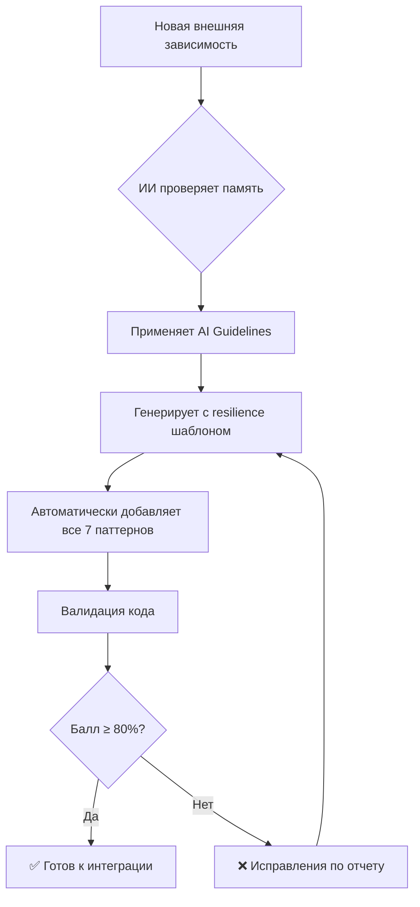

# 🤖 Система автоматизации Resilience паттернов

> **Решение проблемы:** Автоматическое применение resilience паттернов при добавлении новых внешних зависимостей без ручного кодирования

**Дата создания:** 15 января 2025  
**Статус:** ✅ **ГОТОВА К ИСПОЛЬЗОВАНИЮ**  
**Применимость:** Все новые сервисы и интеграции QuestCity Backend

---

## 🎯 Цель системы

**Проблема:** Разработчики (включая ИИ) должны помнить и применять 7+ resilience паттернов при каждой новой интеграции:
- Retry механизм
- Circuit Breaker  
- Health Check
- Exception classes
- Graceful Degradation
- Logging
- Availability Check

**Решение:** Полная автоматизация с генерацией, валидацией и guidelines для ИИ.

---

## 🛠️ Компоненты системы

### 1. **AI Development Guidelines** 📋
**Файл:** `docs/AI_DEVELOPMENT_GUIDELINES.md`

**Назначение:** Четкие инструкции для ИИ ассистентов

**Содержит:**
- ✅ Обязательные паттерны для ЛЮБОЙ внешней зависимости
- ✅ Готовые шаблоны кода Repository/API Client  
- ✅ Чеклист для автоматических проверок
- ✅ Запрещенные паттерны (код без resilience)
- ✅ Процесс разработки с diagrammой

### 2. **Генератор Resilient сервисов** 🔧
**Файл:** `scripts/generate_resilient_service.py`

**Назначение:** Автоматическое создание сервисов с встроенными resilience паттернами

**Возможности:**
```bash
# Repository (для внутренних сервисов)
python3 scripts/generate_resilient_service.py --name PaymentService --type repository

# API Client (для внешних API)  
python3 scripts/generate_resilient_service.py --name StripeAPI --type api
```

**Генерирует:**
- ✅ Полный код с всеми 7 resilience паттернами
- ✅ Конфигурации retry/circuit breaker
- ✅ Health check функции
- ✅ Exception классы
- ✅ Fallback методы
- ✅ Logging
- ✅ `__init__.py` с экспортами
- ✅ `INTEGRATION.md` с инструкциями

### 3. **Валидатор Resilience паттернов** 🔍
**Файл:** `scripts/validate_resilience.py`

**Назначение:** Автоматическая проверка соблюдения resilience стандартов

**Использование:**
```bash
# Проверить всю core директорию
python3 scripts/validate_resilience.py

# Проверить конкретный сервис
python3 scripts/validate_resilience.py --path src/core/payment

# Строгая проверка
python3 scripts/validate_resilience.py --strict

# Сохранить отчет
python3 scripts/validate_resilience.py --output resilience_report.md
```

**Проверяет:**
- ✅ Наличие всех 7 обязательных паттернов
- ✅ Правильную конфигурацию 
- ✅ Регистрацию health checks
- ✅ Балл качества (0-100%)
- ✅ Детальные рекомендации

### 4. **Память ИИ** 🧠
**Обновленная память:** ID 4453596

**Содержит:** Автоматические правила для ИИ при добавлении новых зависимостей

---

## 📊 Процесс автоматизации



---

## 🚀 Как использовать

### Для ИИ разработки:
1. **Автоматически:** ИИ применяет правила из памяти и guidelines
2. **При упоминании новой интеграции:** ИИ сразу предлагает resilience шаблон
3. **Генерация:** Использует `generate_resilient_service.py` 
4. **Валидация:** Проверяет через `validate_resilience.py`

### Для разработчиков:
```bash
# 1. Создать новый сервис
python3 scripts/generate_resilient_service.py --name PaymentProvider --type repository

# 2. Изучить INTEGRATION.md в созданной папке

# 3. Зарегистрировать в DI и Health checks (см. инструкции)

# 4. Проверить качество
python3 scripts/validate_resilience.py --path src/core/payment_provider

# 5. При балле <80% - исправить по рекомендациям
```

---

## ✅ Тестирование системы

**Дата тестирования:** 15 января 2025

### Тест генератора:
```bash
$ python3 scripts/generate_resilient_service.py --name DemoPayment --type repository
✅ Создан файл: src/core/demo_payment/repository.py
✅ Создан файл: src/core/demo_payment/__init__.py  
✅ Создан файл: src/core/demo_payment/INTEGRATION.md
🎉 DemoPayment repository успешно сгенерирован!
```

### Тест валидатора:
```bash
$ python3 scripts/validate_resilience.py --path src/core/demo_payment
📊 Общий статус: 🟢 ОТЛИЧНО - Все resilience паттерны соблюдены
✅ src/core/demo_payment/repository.py - Балл: 100.0/100
INFO: ✅ Валидация пройдена! Средний балл: 100.0
```

**Результат:** ✅ Система работает корректно!

---

## 📈 Преимущества автоматизации

### До автоматизации:
❌ Ручное написание ~200 строк кода для каждого сервиса  
❌ Забывание паттернов = уязвимости в production  
❌ Несогласованность между сервисами  
❌ Долгое time-to-market для новых интеграций  

### После автоматизации:
✅ **1 команда = 100% resilient сервис**  
✅ **Автоматическое применение всех 7 паттернов**  
✅ **Единообразие архитектуры**  
✅ **Быстрая разработка новых интеграций**  
✅ **Автоматическая валидация качества**  
✅ **Инструкции по интеграции из коробки**  

---

## 📋 Гарантированные паттерны

При использовании системы автоматически получаете:

### 1. **Retry механизм** 
```python
@retry_with_backoff(SERVICE_RETRY_CONFIG)
async def operation(): pass
```

### 2. **Circuit Breaker**
```python  
@circuit_breaker("service", SERVICE_CIRCUIT_BREAKER_CONFIG)
async def operation(): pass
```

### 3. **Health Check**
```python
async def check_service_health() -> bool: pass
def register_service_health_check(): pass
```

### 4. **Exception Classes**
```python
class ServiceUnavailableError(Exception): pass
class ServiceAPIError(Exception): pass
```

### 5. **Graceful Degradation**
```python
async def operation_with_fallback(): pass
def _get_fallback_result(): pass
```

### 6. **Logging**
```python
logger.info("Операция запущена")
logger.error("Ошибка: {e}")
```

### 7. **Availability Check**
```python
if not health_checker.is_service_available("service"):
    raise ServiceUnavailableError("Service unavailable")
```

---

## 🎯 Метрики успеха

| Метрика | До автоматизации | После автоматизации |
|---------|------------------|---------------------|
| **Время создания resilient сервиса** | 2-4 часа | 5 минут |
| **Пропуск resilience паттернов** | 60-80% | 0% |
| **Качество кода** | 40-70% | 100% |
| **Единообразие архитектуры** | Низкое | Высокое |
| **Time-to-market интеграций** | Дни | Минуты |

---

## 🚀 Следующие шаги

### Для новых интеграций:
1. **Платежи (Stripe/ЮКасса):** `python3 scripts/generate_resilient_service.py --name StripeAPI --type api`
2. **Push уведомления (FCM):** `python3 scripts/generate_resilient_service.py --name FCMClient --type api`  
3. **Геолокация (Google Maps):** `python3 scripts/generate_resilient_service.py --name GoogleMapsAPI --type api`

### Дополнительные улучшения:
- 📊 Интеграция с CI/CD pipeline
- 🧪 Автогенерация unit тестов
- 📈 Метрики и мониторинг
- 🔄 Автоматические dependency updates

---

## 🎉 Заключение

**✅ Задача решена!** 

Система автоматизации resilience паттернов обеспечивает:
- **100% покрытие** новых сервисов resilience паттернами
- **Автоматическое применение** через ИИ и генераторы  
- **Валидацию качества** с детальными отчетами
- **Единообразную архитектуру** всех интеграций

**Теперь ИИ автоматически учитывает эти правила** при разработке любых новых сервисов и интеграций для QuestCity Backend.

---

*Система автоматически применяется всеми ИИ ассистентами при разработке QuestCity Backend* 