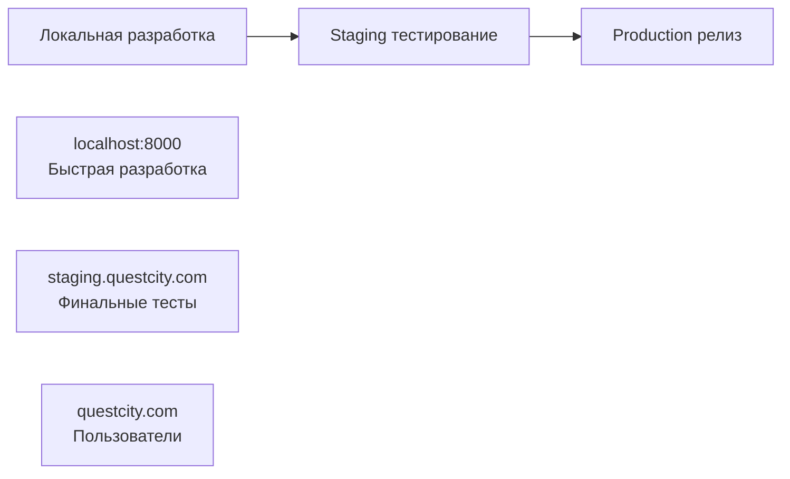

# QuestCity Backend - Локальная vs Удаленная разработка

## 🏠 Локальная разработка (Local Development)

### ✅ Что это означает:
**Разработка на собственном компьютере** - все сервисы запущены локально на вашей машине.

### 🖥️ Компоненты на вашем компьютере:
```
localhost:8000    ← QuestCity Backend (Python/FastAPI)
localhost:5432    ← PostgreSQL база данных
localhost:9000    ← MinIO файловое хранилище
localhost:3000    ← Flutter фронтенд (при разработке)
```

### 🔧 Технические особенности:
- **Быстрая итерация** - изменения видны мгновенно
- **Полный контроль** - можете останавливать/запускать любой сервис
- **Отладка** - breakpoints, логи в реальном времени
- **Тестирование** - можете ломать что угодно без последствий
- **Offline работа** - не нужен интернет для разработки

### 📁 Файловая структура:
```
/Users/evgenijglusenko/Desktop/Questcity/
├── questcity-backend/     ← Локальный код
├── questcity-frontend/    ← Локальный код  
└── данные остаются локально
```

---

## ☁️ Удаленная разработка (Remote/Cloud Development)

### ✅ Что это означает:
**Разработка с удаленными сервисами** - часть компонентов находится на внешних серверах.

### 🌐 Компоненты распределены:
```
localhost:8000         ← Backend (локально)
remote-db.aws.com      ← PostgreSQL в облаке
remote-s3.aws.com      ← S3 хранилище в облаке
questcity.com          ← Продакшен API
```

### 🔧 Технические особенности:
- **Реальные данные** - работаете с production/staging данными
- **Сетевые задержки** - медленнее чем локально
- **Общие ресурсы** - другие разработчики могут влиять
- **Интернет зависимость** - нужно стабильное соединение
- **Ограниченная отладка** - сложнее debug удаленных сервисов

---

## 🎯 Для QuestCity - что выбрать?

### 🏠 Локальная разработка (РЕКОМЕНДУЕТСЯ)

**Когда использовать:**
- ✅ Разработка новых функций
- ✅ Исправление багов  
- ✅ Экспериментирование с кодом
- ✅ Обучение/изучение проекта
- ✅ Первоначальная настройка

**Преимущества для QuestCity:**
- Можете экспериментировать с базой данных без страха
- Быстро тестировать изменения в API
- Полный контроль над файловым хранилищем
- Независимость от интернета

**Недостатки:**
- Нужно настроить все сервисы локально
- Тестовые данные отличаются от production

### ☁️ Удаленная разработка

**Когда использовать:**
- ✅ Финальное тестирование перед релизом
- ✅ Работа с production данными
- ✅ Отладка production багов
- ✅ Демонстрация функций заказчику

**Преимущества:**
- Реальные данные пользователей
- Точно такая же среда как у пользователей
- Не нужно настраивать локальные сервисы

**Недостатки:**
- Медленнее итерации
- Риск повлиять на других пользователей
- Сложнее отладка

---

## 🔄 Гибридный подход (ОПТИМАЛЬНО)

### 🎯 Рекомендуемая стратегия:



### 📋 Workflow:
1. **Разработка** → Локально (быстро, безопасно)
2. **Тестирование** → Staging (реальная среда)  
3. **Релиз** → Production (пользователи)

---

## 🛠️ Настройка для разных сред

### 🏠 Локальная среда:
```bash
# Backend
cd questcity-backend/main
cp .env.development .env
poetry run python3 main.py

# Frontend  
cd questcity-frontend
cp .env.development .env
flutter run
```

### ☁️ Удаленная среда:
```bash
# Backend остается локальным
cd questcity-backend/main
cp .env.production .env  # Указывает на удаленные сервисы
poetry run python3 main.py

# Frontend подключается к удаленному API
cd questcity-frontend
cp .env.production .env  # BASE_URL=https://questcity.com/api/
flutter run
```

---

## 💡 Практические рекомендации

### ✅ Начинайте с локальной разработки:
1. Настройте все сервисы локально
2. Изучите как работает система
3. Разработайте новые функции
4. Протестируйте локально

### ✅ Переходите к удаленной для:
1. Интеграционного тестирования
2. Демонстрации заказчику
3. Финального тестирования
4. Production отладки

### ⚠️ Никогда не разрабатывайте напрямую в production:
- Используйте staging среду
- Тестируйте на копии данных
- Делайте бэкапы перед экспериментами

---

## 🎯 Для QuestCity сейчас

**Текущая ситуация:** У вас есть заготовка локальной среды
- ✅ PostgreSQL локально работает
- ❌ MinIO нужно настроить  
- ❌ Health Checker нужно исправить

**Рекомендация:** Начните с полной локальной настройки из [18_STARTUP_DEPENDENCIES_ANALYSIS.md](18_STARTUP_DEPENDENCIES_ANALYSIS.md)

**Следующие шаги:**
1. Настроить локальную среду (задачи HIGH-007, HIGH-008)
2. Разработать и протестировать функции локально
3. Настроить staging среду для финальных тестов
4. Развернуть в production

---

**Итог:** Локальная разработка = ваш компьютер, быстро, безопасно. Удаленная = внешние сервера, реально, но медленнее. Начинайте локально! 🚀 